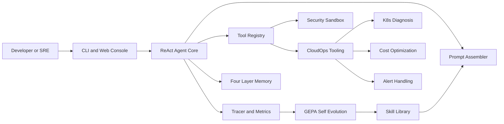

# Athena Agent 架构设计

## 设计目标

Athena 的目标不是封装现成 Agent 框架，而是把企业级智能助手的关键机制拆开实现：可解释的执行循环、可治理的记忆、可审计的工具、安全边界、可观测轨迹和可持续进化的 Skill 体系。

## 分层架构

### 接入层

CLI、TUI、Web Console 和 API 路由只负责请求适配，不直接持有业务规则。Web Console 通过 `AthenaWebService` 统一管理 session、workflow、trace、benchmark 和 CloudOps。

### Agent 核心层

`ReActAgent` 实现 Thought、Action、Observation、Final Answer 的循环。关键可靠性机制包括输入校验、最大步数限制、工具失败返回 Observation、结构化决策解析和异常分级。

### 工具层

`ToolRegistry` 使用装饰器注册工具，通过函数签名生成参数说明，调用结果统一封装为 `ToolResult`。工具层通过沙箱、路径边界和权限模型控制风险。

### 记忆层

- Working Memory：短对话上下文和 Token 裁剪。
- Profile Memory：用户画像与偏好。
- Long-term Memory：向量检索知识。
- Skill Memory：可复用任务流程，支持语义召回。

### GEPA 自进化层

执行轨迹进入 `ComplexityEvaluator`，达到阈值后由 `SkillGenerator` 提取工具、步骤和验证方式，生成标准 Skill。下一次相似任务可通过 Skill Library 召回，减少重复推理和 Token 消耗。

### 可观测性层

Tracer 记录结构化事件，Metrics 统计任务成功率和耗时，Step Debugger 支持断点和暂停模型。Web Console 可展示任务轨迹、步骤状态、性能指标和 Benchmark 报告。

### 云运维层

CloudOps 使用 mock-first 设计，保证无真实云账号也能演示。K8s 诊断、成本优化、资源巡检、告警处置均复用服务层入口，便于前端、API 和脚本保持同一行为。

## 可靠性机制

- 依赖注入：LLM、工具、记忆均可替换，测试可注入 mock。
- 结果类型：工具失败不直接炸掉主循环，而是回传给 Agent 决策。
- 高危确认：重启实例等操作必须带 confirmed 标记。
- 有界内存：Trace 和 Working Memory 都有容量控制。
- 可复现 demo：核心演示默认使用本地 mock，避免面试时受网络和云账号影响。

## 后续演进

1. 将 CloudOps 子步骤改造成真实流式执行。
2. 引入重复 Skill 检测和版本治理。
3. 接入真实账单 API 与 Prometheus 指标。
4. 完善 RBAC、审计日志和审批工作流。
5. 建立长期 Benchmark 数据集，跟踪每次迭代的质量变化。