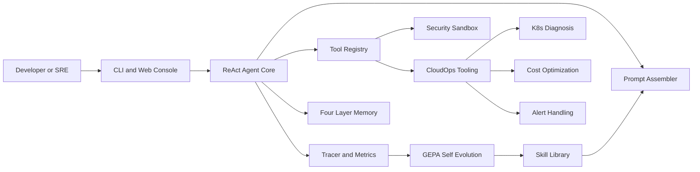
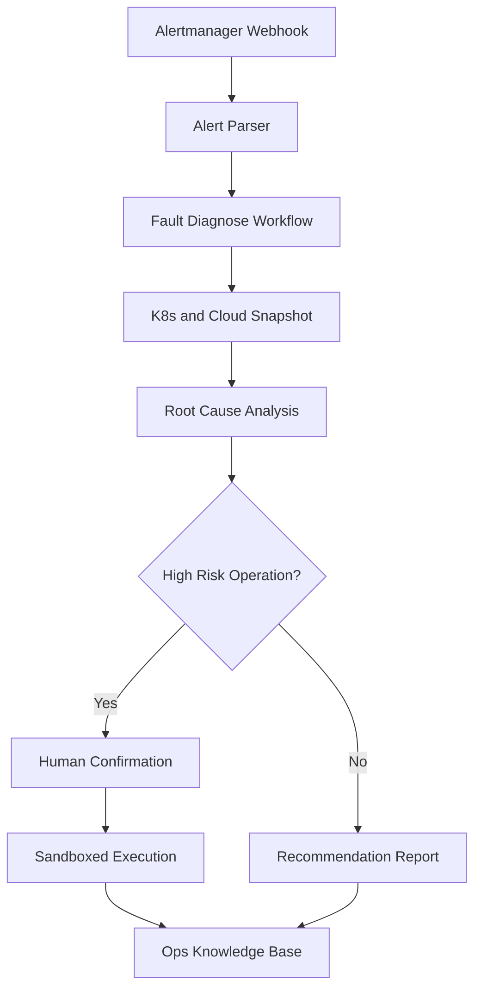

# Athena Agent

```text
	 _   _   _                         _                    _
	/ \ | |_| |__   ___ _ __   __ _   / \   __ _  ___ _ __ | |_
   / _ \| __| '_ \ / _ \ '_ \ / _` | / _ \ / _` |/ _ \ '_ \| __|
  / ___ \ |_| | | |  __/ | | | (_| |/ ___ \ (_| |  __/ | | | |_
 /_/   \_\__|_| |_|\___|_| |_|\__,_/_/   \_\__, |\___|_| |_|\__|
										   |___/
```

Athena Agent 是一个从零实现的自进化企业级智能助手：自研 ReAct Agent 核心、GEPA 自进化闭环、四层记忆系统、企业安全沙箱、全链路可观测性，以及云原生运维场景落地。

## 核心亮点

- 🧠 **自研 Agent Core**：执行循环、Prompt 组装、工具注册和记忆压缩均由项目直接实现，核心链路可解释、可测试、可替换。
- 🔁 **GEPA 自进化闭环**：执行轨迹 → 复杂度评分 → Skill 生成 → Skill 检索复用，沉淀可复用经验。
- 🧩 **四层记忆系统**：Working、Profile、Long-term、Skill Memory 分层管理上下文、画像、知识和技能。
- 🛡️ **企业级安全沙箱**：工具权限、路径边界、高危操作人工确认，降低自动化执行风险。
- 📈 **全链路可观测性**：Trace、Metrics、Web Console、Step Debugger 覆盖执行轨迹、Token 和任务状态。
- ☁️ **云原生运维场景**：K8s 故障排查、云成本优化、告警自动处置和资源巡检均可本地 mock 演示。

## 架构总览



## 云场景闭环



## 5 分钟快速开始

```powershell
python -m venv venv
.\venv\Scripts\Activate.ps1
pip install -r requirements.txt
pip install -e .
python -m pytest
athena chat "你好，请介绍一下 Athena Agent"
```

真实对话需要配置 `.env`：

```env
OPENAI_API_KEY=你的 API Key
ATHENA_LLM_MODEL=deepseek/deepseek-chat
```

Web Console：

```powershell
athena web --host 127.0.0.1 --port 8000
```

访问 `http://127.0.0.1:8000`。

## 功能特性

### 通用 Agent 能力

- ⚙️ ReAct 多步执行循环，支持工具调用、Observation 回填和最大步数保护。
- 🧰 装饰器式 Tool Registry，自动提取函数签名和工具描述。
- 🧠 Token 感知 Working Memory，支持重要性评分和裁剪策略。
- 🔎 Tree-sitter 代码结构解析，面向代码理解与测试生成场景。
- 📚 Skill Library 基于长期记忆做语义召回。
- 📊 Benchmark Engine 支持用例集、成功率和 Markdown 报告输出。

### 云运维能力

- ☸️ K8s CrashLoopBackOff / ImagePullBackOff / 资源压力诊断。
- 💸 云成本优化：识别闲置实例并估算月度节省。
- 🚨 告警自动处置：模拟 Alertmanager webhook，触发故障排查工作流。
- 🔐 高危操作确认：重启实例等动作必须经过 confirmed 标记。
- 🧾 运维知识沉淀：故障工作流结果可进入 Ops Knowledge Base。

## Demo

| Demo | 场景 | 命令 |
| --- | --- | --- |
| Demo 1 | 代码智能助手：分析代码库 → 生成单元测试草案 | `python examples/demo1_code_analysis.py` |
| Demo 2 | 自进化演示：复杂任务 → 自动生成 Skill → 下次召回 | `python examples/demo2_self_evolution.py` |
| Demo 3 | 调试面板：轨迹、断点、Token 统计 | `python examples/demo3_debugger.py` |
| Demo 4 | K8s 故障自动排查 | `python examples/demo4_k8s_diagnose.py` |
| Demo 5 | 云成本智能优化 | `python examples/demo5_cost_optimize.py` |
| Demo 6 | 告警自动处置 | `python examples/demo6_alert_auto_handle.py` |

Demo 视频/GIF 建议录制后放入 `assets/`，README 中可替换为：

```markdown

```

## 技术栈

- Python 3.11+
- LiteLLM 模型适配层
- Typer / Rich / Textual CLI 与 TUI
- FastAPI / Uvicorn Web Console
- Pydantic / SQLAlchemy 数据建模
- Tree-sitter 代码解析
- RestrictedPython 安全沙箱
- Milvus 适配边界与内存向量库 fallback
- Kubernetes / Prometheus / 云厂商 SDK 演示适配

## 文档

- [ARCHITECTURE.md](ARCHITECTURE.md)
- [GETTING_STARTED.md](GETTING_STARTED.md)
- [DEVELOPMENT.md](DEVELOPMENT.md)
- [DEPLOYMENT.md](DEPLOYMENT.md)
- [API_REFERENCE.md](API_REFERENCE.md)
- [FAQ.md](FAQ.md)
- [docs/demos/demo_guide.md](docs/demos/demo_guide.md)
- [docs/benchmarks/performance_report.md](docs/benchmarks/performance_report.md)
- [docs/interview/resume.md](docs/interview/resume.md)
- [docs/interview/questions.md](docs/interview/questions.md)
- [docs/interview/demo_script.md](docs/interview/demo_script.md)

## 质量红线

- 当前 `requirements.txt` 未引入 LangChain、AutoGen、LlamaIndex 等第三方 Agent 框架。
- 性能报告只记录可复现实测数据，未实测的对比项保留为待补录。
- 面试前必须本机跑通 6 个 demo、`pytest`、格式化、类型检查和覆盖率报告。

## 贡献指南

1. Fork 仓库并创建 feature 分支。
2. 安装依赖：`pip install -r requirements.txt && pip install -e .`。
3. 新增功能必须附带单元测试或 demo 验证路径。
4. 提交前运行 `black .`、`isort .`、`mypy athena examples tests`、`pytest`。
5. PR 描述写清楚变更动机、测试结果和潜在风险。

## Star History

项目公开后可替换为真实仓库地址：

```markdown
[](https://star-history.com/#yourname/athena-agent&Date)
```
