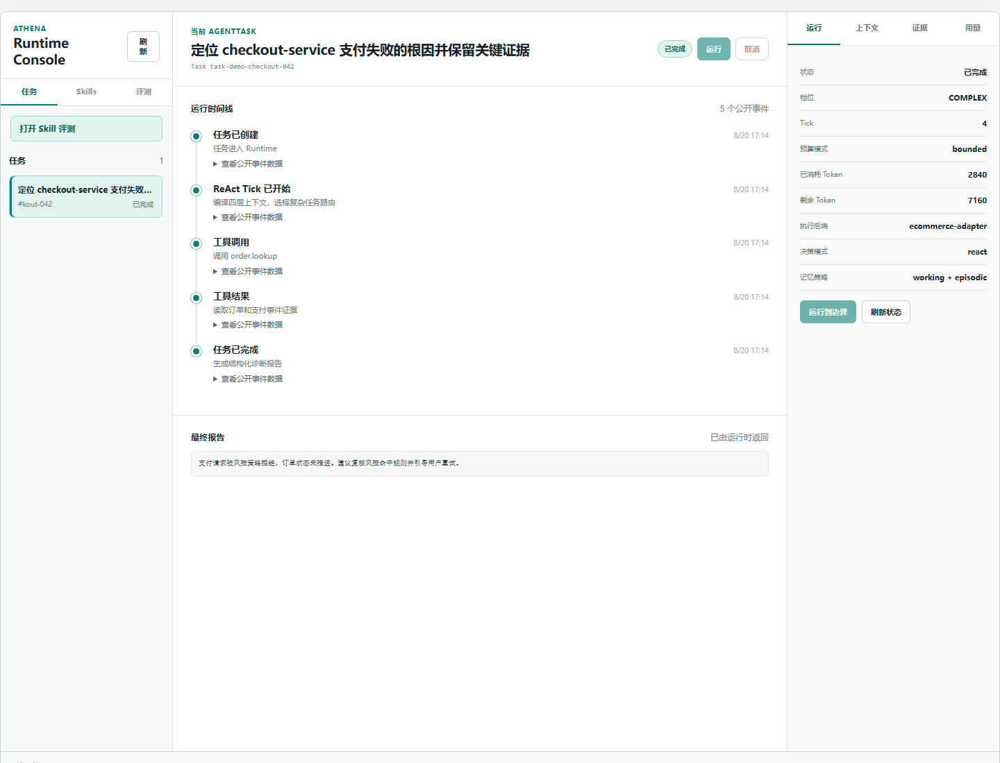
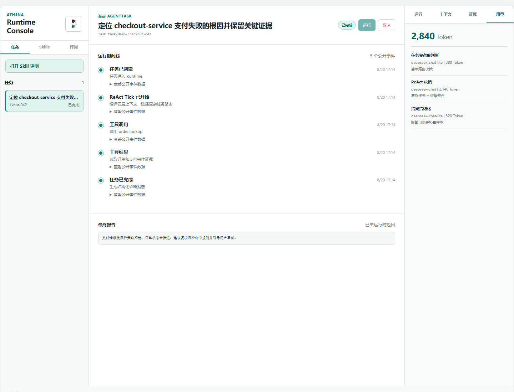
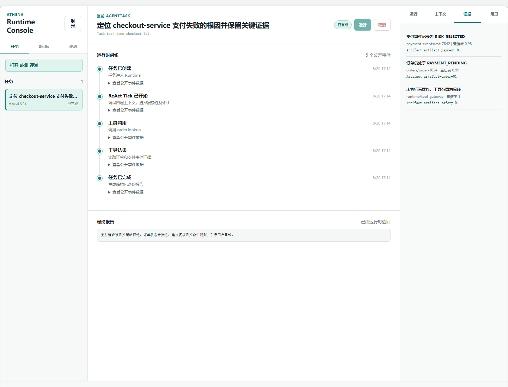
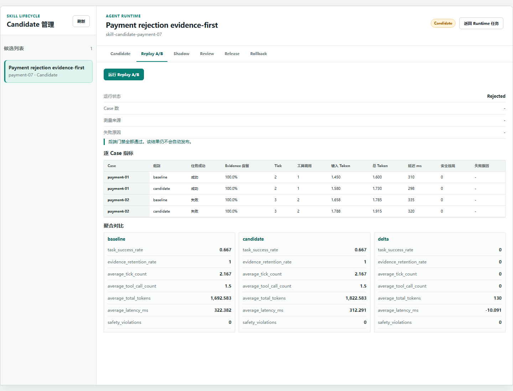
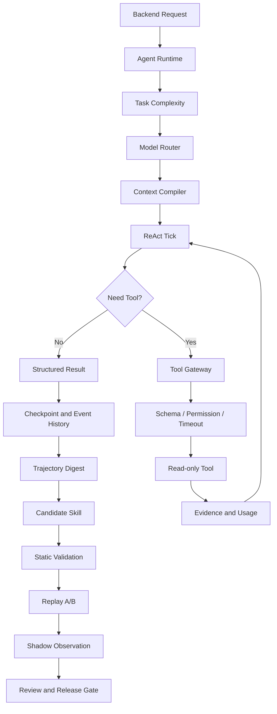
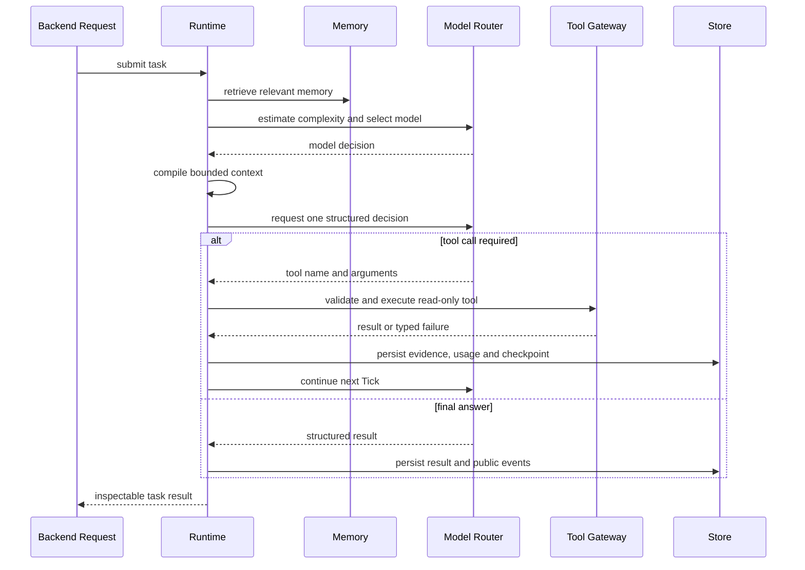

# Athena Agent Runtime

面向后端任务自动化的可观测 ReAct Agent Runtime。

Athena 负责把一个后端任务拆成受约束的 ReAct 执行过程，并统一管理上下文、记忆、模型路由、工具调用、证据、Token 使用、检查点和 Skill 学习。电商适配器只是第一个业务落地场景，Runtime 内核与业务领域解耦。

> 当前项目定位：可运行、可观测、可评测的 Agent Runtime 核心架构原型。它不是声称已经达到 Claude Code、OpenClaw 等产品的完整生产规模。

## 控制台预览

Runtime Console 用于观察 Agent 的真实执行过程，而不是只展示最终回答。









四张图分别展示任务总览、Token 用量与模型路由、Evidence 检查器、Skill Replay A/B 评测。页面默认连接真实 Runtime API；为了在没有数据库和 Provider 凭证时预览界面，也提供只读演示数据：

```text
http://127.0.0.1:8000/?demo=1
http://127.0.0.1:8000/?demo=1&inspector=usage
http://127.0.0.1:8000/?demo=1&view=skills&section=replay
```

演示模式只在浏览器内提供固定的公开投影，不会调用 Provider、写入数据库或执行工具。

## 为什么做这个 Runtime

普通 Agent Demo 通常只展示“输入问题 -> 输出答案”，但后端业务真正关心的是执行过程是否可控：

- 对话历史过长时，Token 成本和上下文噪声会持续增长；
- 工具参数错误、超时或失败后，Agent 需要有边界地恢复；
- 多轮执行必须能够追踪每个 Tick、工具调用和证据来源；
- 一次任务产生的经验不能直接变成线上行为，必须经过校验和评测；
- Agent 生成的 Skill 不能绕过权限、工具和安全边界。

Athena 的目标是提供一个后端业务可以复用的 Agent 执行层：业务适配器提供任务和只读工具，Runtime 负责可靠执行与治理。

## 整体架构


```mermaid
flowchart TD
    A[Backend Request] --> B[Agent Runtime]
    B --> C[Task Complexity]
    C --> D[Model Router]
    D --> E[Context Compiler]
    E --> F[ReAct Tick]
    F --> G{Need Tool?}
    G -- No --> H[Structured Result]
    G -- Yes --> I[Tool Gateway]
    I --> J[Schema / Permission / Timeout]
    J --> K[Read-only Tool]
    K --> L[Evidence and Usage]
    L --> F
    H --> M[Checkpoint and Event History]
    M --> N[Trajectory Digest]
    N --> O[Candidate Skill]
    O --> P[Static Validation]
    P --> Q[Replay A/B]
    Q --> R[Shadow Observation]
    R --> S[Review and Release Gate]
```

Runtime 内核与业务适配器分离：

```text
HTTP / CLI / Console
        |
Runtime Task Service
        |
AgentRuntime
  |-- bounded ReAct execution
  |-- context and memory governance
  |-- model routing and token budget
  |-- tool gateway and safety boundary
  |-- evidence, usage and checkpoint
        |
Backend Adapter
  |-- task contract
  |-- read-only tools
  |-- replay cases
```

## 一次任务如何执行


```mermaid
sequenceDiagram
    participant U as Backend Request
    participant R as Runtime
    participant M as Memory
    participant L as Model Router
    participant T as Tool Gateway
    participant S as Store

    U->>R: submit task
    R->>M: retrieve relevant memory
    R->>L: estimate complexity and select model
    L-->>R: model decision
    R->>R: compile bounded context
    R->>L: request one structured decision
    alt tool call required
        L-->>R: tool name and arguments
        R->>T: validate and execute read-only tool
        T-->>R: result or typed failure
        R->>S: persist evidence, usage and checkpoint
        R->>L: continue next Tick
    else final answer
        L-->>R: structured result
        R->>S: persist result and public events
    end
    R-->>U: inspectable task result
```

每个 Tick 只允许一次结构化决策和一次逻辑工具动作，并受最大 Tick、Token 预算、超时和权限约束。

## 核心设计

### 1. ReAct 执行引擎

- 将任务执行拆成 bounded Tick，而不是允许模型无限循环；
- 每轮只返回结构化决策：继续思考、调用工具或结束任务；
- 保存任务状态、工具结果、Evidence、Token 使用和检查点；
- 工具失败会生成显式失败证据，交给下一轮重新决策；
- 达到 Tick、Token 或时间上限时，Runtime 返回可解释的失败状态。

### 2. 四层记忆与上下文治理

四层记忆不是全部直接放入模型上下文：

| 层级 | 内容 | 读取方式 |
| --- | --- | --- |
| Working Memory | 当前任务、最近工具结果和待处理状态 | 每个 Tick 编译 |
| Episodic Memory | 由通过 Eligible 门禁的脱敏轨迹生成的历史任务摘要和结果 | 按租户、关键词检索；可持久化 |
| Semantic Memory | 经过审核的稳定领域事实和规则 | 按租户、关键词检索；仅 `approved` 可进入上下文 |
| Skill Memory | 已验证的执行策略 | 通过 Candidate、静态校验和评测门禁读取 |

Context Compiler 会根据任务相关性、优先级和 Token 预算选择内容，超过预算时依次压缩历史、裁剪工具结果和降低检索数量。模型只接收本轮真正需要的上下文。

Episodic 和 Semantic 的写入边界不同：完成且通过安全门禁的任务会自动投影为 Episodic Memory；Semantic Memory 只能先以 `candidate` 提交，经过显式审核后变成 `approved`，被拒绝或未审核的事实不会被检索给模型。两层都按 `tenant_id` 隔离。

长期记忆默认使用 Durable Store 持久化，默认本地 SQLite 路径为 `D:\mjy_agent\.tmp\athena-runtime.db`。相关表包括：

```text
runtime_checkpoints       # Runtime 检查点
runtime_evidence          # Evidence 引用
runtime_artifacts         # 工具产物
runtime_usage             # Token 与模型用量
runtime_skill_memory      # 评测后的 Skill 投影
runtime_episodic_memory   # 历史任务摘要
runtime_semantic_memory   # 有审核状态的领域事实
```

Runtime 在 Durable Store 初始化失败时，生产 profile 不会静默降级到内存；开发和演示 profile 才允许使用明确的内存回退。

### 3. Token 优化与模型路由

Runtime 记录每次模型调用的输入、输出和总 Token，并根据任务复杂度选择模型：

- 简单任务使用轻量模型；
- 复杂任务或连续失败任务升级到高能力模型；
- 历史对话使用摘要代替原始消息；
- 工具输出只保留契约字段和证据摘要；
- 相同上下文和任务优先使用缓存；
- 每个任务拥有独立的输入、输出和总 Token 预算。

模型路由不是只按模型名称切换，还会结合任务复杂度、剩余预算、历史失败次数和当前 Tick 做决策。

### 4. Tool Gateway

所有工具调用经过统一网关：

1. 校验模型输出中的工具名称和参数 Schema；
2. 检查租户、Scope 和工具权限；
3. 由 Runtime 生成 Call ID，避免模型伪造调用身份；
4. 执行超时、有限重试和错误分类；
5. 将成功结果或失败原因写入 Evidence；
6. 把结构化结果返回给下一次 ReAct Tick。

工具是 Runtime 的能力边界。Candidate Skill 只能提供策略和约束，不能注册工具、执行任意代码或绕过权限检查。

### 5. Skill 学习与自进化

```text
Task Trajectory
      |
      v
Redacted Trajectory Digest
      |
      v
Candidate Skill Generation
      |
      v
Static Validation
      |
      v
Replay A/B: Baseline vs Candidate
      |
      v
Shadow Observation
      |
      v
Review and Release Gate
```

学习记录只保存脱敏轨迹摘要，不保存原始 Prompt、隐藏思维链或敏感凭证。Skill 必须先处于 Candidate 状态，经过静态校验、Replay A/B 和 Shadow 观察后，才有资格进入人工审核和发布流程。

## 电商后端适配

电商适配器用于证明 Runtime 可以接入真实后端问题，而不是把电商逻辑写进 Runtime 内核。

示例任务：

```text
订单为什么支付失败？
```

Agent 可以按以下步骤执行：

1. 查询订单状态；
2. 查询支付记录；
3. 查询库存或业务事件；
4. 汇总证据并判断可能原因；
5. 输出结构化诊断结果和下一步建议。

换成客服、风控、供应链、研发助手或数据分析场景时，只需要替换后端领域适配器、工具和 Replay Case，Runtime 核心保持不变。

## 实验与验证

项目同时支持离线确定性测试和 Provider Benchmark：

- 离线测试验证 Runtime 合同、工具边界、记忆治理和 Skill 生命周期；
- Replay A/B 使用同一批任务比较 Baseline 与 Candidate；
- Shadow 用于观察 Candidate 在真实或模拟流量下的行为，不直接改变线上结果；
- Provider Benchmark 用于记录不同模型的 Token、延迟、成功率和成本。

当前已经验证的重点指标包括：

| 指标 | 用途 |
| --- | --- |
| task_success | 判断任务是否完成 |
| evidence_retention | 判断关键证据是否保留 |
| tick_count | 衡量执行步数 |
| tool_call_count | 衡量工具调用次数 |
| input/output/total_tokens | 衡量上下文成本 |
| latency_ms | 衡量响应延迟 |
| safety_violations | 衡量安全边界是否被突破 |

真实实验结果必须同时记录任务集、模型、Provider、价格配置和运行时间，避免把单次 Demo 结果当成通用结论。

#### Skill Replay A/B 负向门禁案例

下面是早期 Candidate Skill 的真实离线 Replay A/B 结果。它没有发布，因为功能指标不下降但 Token 成本超过门禁：

| 指标 | Baseline | Candidate | 变化 |
| --- | ---: | ---: | ---: |
| 任务成功率 | 66.67% | 66.67% | 0 |
| Evidence 保留率 | 100% | 100% | 0 |
| 平均 Tick | 2.167 | 2.167 | 0 |
| 平均工具调用 | 1.500 | 1.500 | 0 |
| 平均输入 Token | 1553.917 | 1683.917 | +8.366% |
| 平均总 Token | 1692.583 | 1822.583 | +7.681% |
| 平均延迟 | 322.382 ms | 312.291 ms | -3.130% |
| 安全违规 | 0 | 0 | 0 |

该 Candidate 因总 Token 增幅超过 5% 的发布门禁而被拒绝，没有进入 Active。这个结果说明评测链路能够发现“功能不下降但成本变高”的 Skill，而不是只统计成功率。

#### 四层记忆 Token A/B

在固定 12 Case 任务集上，使用真实 DeepSeek Provider，对比完整历史上下文和四层记忆上下文：

| 指标 | Full History | Four Layer | 变化 |
| --- | ---: | ---: | ---: |
| Case 数量 | 12 | 12 | 相同 |
| 任务成功率 | 100% | 100% | 0 |
| Evidence 保留率 | 100% | 100% | 0 |
| 平均 Tick | 2.83 | 2.83 | 0 |
| 平均输入 Token | 3422.17 | 2646.25 | -22.67% |
| 平均输出 Token | 168.67 | 172.92 | +2.52% |
| 平均总 Token | 3590.83 | 2819.17 | -21.49% |
| P50 延迟 | 6506.670 ms | 5017.146 ms | -22.89% |
| P95 延迟 | 19154.575 ms | 8732.689 ms | -54.41% |
| 安全违规 | 0 | 0 | 0 |

该实验使用固定离线任务集和真实 `deepseek/deepseek-chat`，运行报告保存在本机 `D:\mjy_agent\.tmp`，不是线上流量或生产 SLA。当前价格配置没有匹配该 Provider 的价格字段，因此不宣称费用下降；Token 降低只能说明这组任务上的上下文成本下降。

## 代码结构

```text
athena/
├── runtime/       # Agent Runtime、ReAct、四层记忆、Durable Store、Tool Gateway
├── learning/      # Trajectory、Skill 生成与静态校验
├── evaluation/    # Replay、A/B、Shadow 和 Provider Benchmark
├── backend/       # 电商后端适配器与只读工具
├── application/   # 任务、学习、评测和流量编排服务
├── api/            # HTTP API、Repository 和路由
├── infra/          # 模型、缓存、Token 和韧性组件
└── web/            # Runtime Console 前端
```

## 当前边界

Athena 当前重点是 Agent Runtime 的核心机制和工程验证：

- 当前以单 Agent ReAct 为主，多 Agent 协作不是本项目的核心卖点；
- 电商适配器是参考实现，不代表接入任意业务后即可自动完成所有任务；
- Provider Benchmark 需要用户自行配置模型凭证；
- Skill 发布仍需要显式审核和发布门禁；
- Shadow 主要用于对 Candidate 的线上行为进行观测；
- 项目不保存隐藏 Chain-of-Thought，也不把模型输出直接当作可信执行指令。

## 后续方向

- 完善多 Agent 工作流编排；
- 增加客服、风控、供应链等后端适配器；
- 完善 Shadow 流量平台、人工审批和回滚；
- 持续扩充跨模型、跨任务的可复现实验数据。

## License

待补充。
