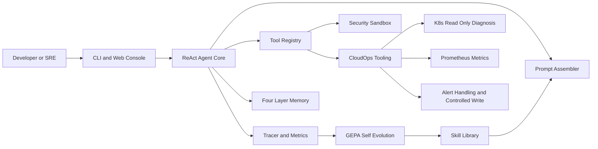
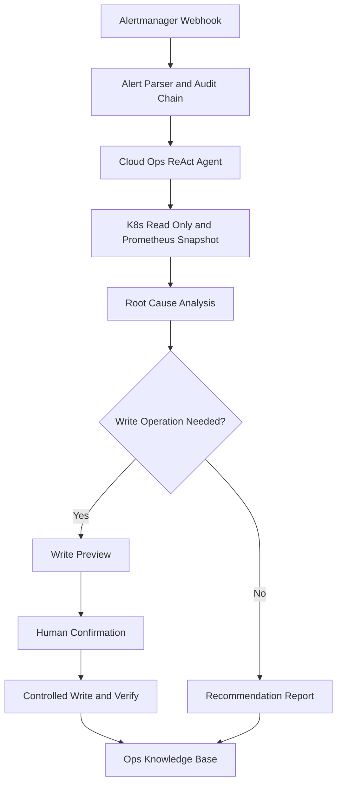

# Athena Agent

```text
	 _   _   _                         _                    _
	/ \ | |_| |__   ___ _ __   __ _   / \   __ _  ___ _ __ | |_
   / _ \| __| '_ \ / _ \ '_ \ / _` | / _ \ / _` |/ _ \ '_ \| __|
  / ___ \ |_| | | |  __/ | | | (_| |/ ___ \ (_| |  __/ | | | |_
 /_/   \_\__|_| |_|\___|_| |_|\__,_/_/   \_\__, |\___|_| |_|\__|
										   |___/
```


## 项目背景

市面上大量 Agent 项目存在三类共性问题：**① 强依赖 LangChain / AutoGen 等黑盒框架**，链路不透明、难调试、受框架版本与生态牵制；**② 缺少生产级可靠性设计**，多停留在 demo 阶段，没有持久化、鉴权、审计、可观测与高可用；**③ 强依赖外部服务**，缺少 API Key 或云环境便无法运行，本地体验门槛高。

**Athena Agent 的定位：一个从零实现、面向生产环境的云运维智能体。** 自研 ReAct Agent 核心，内建生产级可靠性与治理能力，并以「真实实现 + 优雅降级」保证本地零配置可跑、生产接入即生效。

`🧩 100% 自研 Agent 核心` · `🏗️ 生产级可靠性设计` · `☁️ 云运维场景完整落地`

> **工程原则：真实实现 + 优雅降级。** 所有外部依赖（Redis、Milvus、LLM、K8s、Prometheus、云厂商 SDK、JWT）都走真实集成路径；当凭证或服务缺失时自动降级到内存 / 关键词 / mock 兜底，保证本地零配置可跑、生产接入即生效。

## 核心亮点

- 🧠 **自研 Agent Core（0 框架锁定）**：执行循环、Prompt 组装、工具注册、记忆压缩全部自研实现。*解决* 主流项目黑盒依赖难调试、受框架版本牵制的问题；*价值* 核心链路可解释、可断点、可替换，问题定位更快，无第三方 Agent 框架依赖。
- 🔁 **GEPA 自进化闭环**：执行轨迹 → 复杂度评分 → Skill 生成 → Skill 检索复用。*解决* Agent 重复踩坑、经验无法沉淀的问题；*价值* 高频任务自动固化为可复用 Skill，相似任务直接召回，减少重复推理与 Token 开销。
- 🧩 **四层记忆系统**：Working / Profile / Long-term / Skill Memory 分层管理上下文、画像、知识与技能。*解决* 单一上下文或向量库职责混杂、检索噪声大的问题；*价值* 职责分治让召回更精准、上下文更省 Token。
- 🛡️ **企业级安全沙箱**：工具权限白名单、路径边界、高危操作人工确认。*解决* 自动执行工具存在越权、误删等安全风险；*价值* 把自动化执行关进「可控笼子」，高危动作强制 confirmed。
- 📈 **全链路可观测性**：Trace、Metrics、Web Console、Step Debugger，配套 Prometheus 指标、SLO 燃尽率告警与 Grafana 面板。*解决* Agent 执行像黑盒、线上排障困难的问题；*价值* 执行轨迹、Token 与任务状态全可见，显著降低调试与排障成本。
- 🏗️ **生产就绪高可用**：Redis 持久化、健康探针与优雅关闭、RBAC/JWT 鉴权、防篡改审计链、K8s HPA/PDB/Ingress 一站式落地。*解决* 多数 Agent demo 缺高可用无法上生产的问题；*价值* 服务无状态可水平扩展，具备直接进入生产环境的工程完备度。
- ☁️ **云原生运维场景**：K8s 只读诊断（CrashLoopBackOff / ImagePullBackOff / Pending / Service 无 Endpoints）、Prometheus 指标佐证、告警自动处置与受控写操作（人工确认后修复）。*解决* 场景空泛、难以端到端落地的问题；*价值* Kubernetes / Prometheus 真实 SDK 直连，形成「监控 → 诊断 → 处置 → 沉淀」完整闭环。

## 架构总览


```mermaid
flowchart LR
	User[Developer or SRE] --> CLI[CLI and Web Console]
	CLI --> Agent[ReAct Agent Core]
	Agent --> Prompt[Prompt Assembler]
	Agent --> Tools[Tool Registry]
	Agent --> Memory[Four Layer Memory]
	Tools --> Sandbox[Security Sandbox]
	Tools --> Cloud[CloudOps Tooling]
	Agent --> Trace[Tracer and Metrics]
	Trace --> GEPA[GEPA Self Evolution]
	GEPA --> Skills[Skill Library]
	Skills --> Prompt
	Cloud --> K8s[K8s Read Only Diagnosis]
	Cloud --> Prom[Prometheus Metrics]
	Cloud --> Alert[Alert Handling and Controlled Write]
```

## 核心技术权衡

工程价值往往体现在关键取舍上。以下是三个核心技术决策：

- **自研 Agent 核心，而非集成 LangChain / AutoGen。** 第三方框架抽象层厚、链路黑盒、受版本与生态牵制，出问题难以下钻定位。自研虽前期成本更高，但换来核心执行循环完全可解释、可断点、可替换，无框架锁定，也更贴合云运维这类需要精细控制的场景。
- **优雅降级，而非强制依赖外部服务。** 若强绑定 Redis / Milvus / 云 SDK / API Key，本地体验与测试门槛极高。因此每个外部依赖都设计「真实集成 + 缺失降级」双路径（内存 / 关键词 / mock 兜底），代价是需维护两条路径，收益是零配置即可跑通、生产接入即生效、测试不依赖外部环境。
- **四层记忆拆分，而非单一向量库。** 把所有上下文塞进一个向量库会导致职责混杂、检索噪声大、Token 浪费。按 Working / Profile / Long-term / Skill 四层拆分后，各层独立管理与召回，代价是设计与协调更复杂，收益是检索更精准、上下文更省、经验可沉淀复用。

## 项目目录结构

```text
athena/
├── agent/          # 自研 ReAct 核心、推理循环、多 Agent 工作流编排
├── memory/         # 四层记忆系统（Working / Profile / Long-term / Skill）
├── tools/          # 工具注册、安全沙箱、防篡改审计链、云运维工具集
├── api/            # Web 服务、RBAC/JWT 鉴权、审计与告警接口、健康探针
├── observability/  # 链路追踪、熔断限流、Prometheus 指标与 SLO 告警
├── learning/       # GEPA 自进化、复杂度评分、Skill 生成与优化
├── infra/          # LLM 适配、缓存（Redis 降级）、向量库、嵌入
└── evaluation/     # Benchmark 引擎与评测报告
```

## 云场景闭环


```mermaid
flowchart TB
	Alert[Alertmanager Webhook] --> Parse[Alert Parser and Audit Chain]
	Parse --> Agent[Cloud Ops ReAct Agent]
	Agent --> Snapshot[K8s Read Only and Prometheus Snapshot]
	Snapshot --> Diagnose[Root Cause Analysis]
	Diagnose --> Guard{Write Operation Needed?}
	Guard -->|No| Report[Recommendation Report]
	Guard -->|Yes| Preview[Write Preview]
	Preview --> Confirm[Human Confirmation]
	Confirm --> Execute[Controlled Write and Verify]
	Execute --> Knowledge[Ops Knowledge Base]
	Report --> Knowledge
```

## 生产就绪能力（Enterprise Readiness）

以下是面向大厂生产标准落地的高可用与治理能力，全部有真实实现与测试覆盖，也是本项目区别于普通 demo 的核心工程壁垒（对应实现文件详见 [开发文档](DEVELOPMENT.md)）：

| 维度 | 能力 | 生产价值 |
| --- | --- | --- |
| 🗄️ 状态持久化 | 会话 / 任务 / 指标 / 评测报告外置 Redis，重启不丢、多副本共享 | 服务无状态，可水平扩展 |
| ❤️ 健康与发布 | `/healthz` 存活、`/readyz` 就绪 + Lifespan 优雅关闭（置 draining、排空任务、关连接） | 滚动升级零感知，K8s 自动摘流不丢请求 |
| 🔐 鉴权授权 | Scope 级 RBAC（`workflow:run` / `cloud:execute` / `benchmark:run` / `audit:read`）+ 可选 JWT Bearer；未配置凭证时默认放行保证向后兼容 | 细粒度最小权限，支持多租户接入 |
| 🧾 防篡改审计 | `sha256(prev_hash + payload)` 哈希链集中落库，`/api/audit/verify` 可对外证明完整性 | 操作留痕不可抵赖，满足合规审计 |
| 📊 SLO 与告警 | 可用性 99.5% / 延迟 P99<500ms，多窗口燃尽率告警（快烧 14.4x / 慢烧 6x）+ Alertmanager 抑制路由 + Grafana 面板 | 错误预算量化，故障提前分级预警 |
| 🔁 告警闭环 | Alertmanager Webhook → 解析 → 写审计链，接自愈工作流入口 | 监控到处置全自动，缩短 MTTR |
| 🧯 弹性容错 | 自研异步熔断器、退避重试、限流，LLM 依赖故障自动降级 | 依赖抖动不雪崩，核心链路不被打垮 |
| ☸️ 云原生编排 | Docker 多阶段非 root 镜像、K8s Deployment/HPA（CPU+自定义指标）/PDB/Ingress(TLS) | 一键部署，按负载弹性伸缩 |
| ✅ 质量保障 | 178+ 项测试通过，含针对真实 Redis 的集成测试与 Locust 压测脚本 | 回归有保障，性能可度量 |

## 5 分钟快速开始

### 环境准备

Linux / macOS：

```bash
python -m venv venv
source venv/bin/activate
pip install -r requirements.txt
pip install -e .
python -m pytest -m "not integration"
```

Windows PowerShell：

```powershell
python -m venv venv
.\venv\Scripts\Activate.ps1
pip install -r requirements.txt
pip install -e .
python -m pytest -m "not integration"
```

### 零配置体验模式（无需任何 API Key / 外部服务）

得益于「优雅降级」设计，不填任何配置即可跑通以下能力：

```bash
athena web --host 127.0.0.1 --port 8000   # 启动 Web Console，访问 http://127.0.0.1:8000
```

零配置下可用：Web Console、`/healthz` `/readyz` 健康探针、指标与审计接口、多 Agent 工作流（规则降级）、云运维场景（mock 数据）、Benchmark 评测（确定性 runner）、全量单元测试。缓存 / 向量库 / 嵌入均自动降级到内存后端。

### 完整功能模式（启用真实 LLM）

配置 `.env` 后启用真实对话与规划能力：

```env
OPENAI_API_KEY=你的 API Key
ATHENA_LLM_MODEL=deepseek/deepseek-chat
```

```bash
athena chat "你好，请介绍一下 Athena Agent"
```

**预期效果**：CLI 返回带完整 ReAct 推理轨迹（Thought / Action / Observation）的回答；Web Console 可实时查看执行步骤、Token 消耗与任务状态。配置 Redis（`redis_url`）后，会话 / 任务 / 审计自动持久化并支持多副本共享。

### 四种启动方式（按场景选择）

| 命令 | 场景 | 说明 |
| --- | --- | --- |
| `athena chat "你的问题"` | 单次问答 / 脚本管道 | 跑完即退出，返回码可供 CI 判断成败（`-c/--config` 指定配置） |
| `athena start` | 交互式多轮对话 | REPL 循环，同一会话共享 WorkingMemory，输入 `exit`/`quit` 退出 |
| `athena tui` | 富终端界面 | 基于 Textual 的 TUI，适合本地交互演示 |
| `athena web --host 127.0.0.1 --port 8000` | Web 控制台 / API 服务 | 启动 FastAPI + Uvicorn，命令行参数优先级高于 config.yaml |

> 未安装为命令时，可用 `python -m athena.cli <子命令>` 等价调用。

### 常用环境变量早见表

所有配置都可用 `config.yaml` 或环境变量提供，**环境变量优先级更高**（默认值 → `config.yaml` → 环境变量）。

| 环境变量 | 覆盖项 | 示例 |
| --- | --- | --- |
| `ATHENA_LLM_MODEL` | LLM 模型 | `deepseek/deepseek-chat` |
| `ATHENA_LOG_LEVEL` | 日志级别 | `DEBUG` |
| `ATHENA_WEB_HOST` / `ATHENA_WEB_PORT` | Web 监听地址 / 端口 | `0.0.0.0` / `8000` |
| `ATHENA_WEB_CORS_ORIGINS` | 允许跨域来源（逗号分隔） | `https://a.com,https://b.com` |
| `ATHENA_REDIS_URL` | Redis 持久化地址 | `redis://127.0.0.1:6379/0` |
| `ATHENA_API_KEYS` | 开启鉴权并注入 Key（`key:tenant` 逗号分隔） | `k1:teamA,k2:teamB` |
| `ATHENA_OPS_K8S_KUBECONFIG` | kubeconfig 路径 | `~/.kube/config` |
| `ATHENA_OPS_K8S_CONTEXT` | kubeconfig context | `kind-athena-demo` |
| `ATHENA_OPS_K8S_NAMESPACE_ALLOWLIST` | 命名空间白名单（逗号分隔） | `athena-demo,default` |
| `ATHENA_OPS_PROMETHEUS_ENABLED` / `_BASE_URL` | 开关 / 地址 | `true` / `http://localhost:30090` |
| `ATHENA_OPS_PROD_WRITE_ENABLED` | prod 环境放开写操作 | `true` |
| `ATHENA_OPS_WEBHOOK_SECRET` | 告警 webhook 共享密钥 | `<secret>` |
| `ATHENA_OPS_REQUIRE_DURABLE_AUDIT` | 强制审计落 Redis（否则启动报错） | `true` |

## 功能特性

### 通用 Agent 能力

- ⚙️ ReAct 多步执行循环，支持工具调用、Observation 回填和最大步数保护。
- 🧰 装饰器式 Tool Registry，自动提取函数签名和工具描述。
- 🧠 Token 感知 Working Memory，支持重要性评分和裁剪策略。
- 🔎 Tree-sitter 代码结构解析，面向代码理解与测试生成场景。
- 📚 Skill Library 基于长期记忆做语义召回。
- 📊 Benchmark Engine 支持用例集、成功率和 Markdown 报告输出。

### 云运维能力

- ☸️ **K8s 只读诊断**：CrashLoopBackOff / ImagePullBackOff / Pending 不可调度 / Service selector 无 Endpoints / 节点压力等，均由 Kubernetes 官方 SDK 直连真实集群拉取（Pods / Events / Logs / Deployments / Services / Endpoints / Nodes）。
- 📈 **Prometheus 指标佐证**：`/api/cloud-ops` 诊断串联真实 Prometheus 查询作为指标证据；不可用时结构化标注 `available=false`，绝不返回模拟指标。
- 🚨 **告警自动处置**：`POST /api/alerts/webhook` 接 Alertmanager，解析后写入防篡改审计链并触发诊断；可配 `X-Alert-Secret` 共享密钥强制校验。
- 🔐 **受控写操作**：仅允许低风险 Deployment 动作（`rollout_restart` / `scale` / `pause` / `resume`），走「预览 → 人工确认 → 执行 → 校验」；`prod` 环境默认禁写，需 `ATHENA_OPS_PROD_WRITE_ENABLED=true` 显式开启。
- 🧾 **运维知识沉淀**：诊断结果进入 Ops Knowledge Base，支持向量语义召回（嵌入缺失降级关键词）。

> **真实链路说明**：K8s 诊断为「真实优先、无 mock」——连接/调用失败直接报错（`OPS_REAL_UNAVAILABLE`），不返回模拟数据，避免假数据误导根因判断。本地可用 `deploy/kind-demo/` 一键起真实集群联调，详见下方 [云运维实操](#云运维实操从连接集群到诊断处置)。

## 云运维实操：从连接集群到诊断处置

以下是把 Athena 接到**真实 Kubernetes 集群**做只读诊断、告警闭环与受控修复的完整操作。本地无集群也能用 `deploy/kind-demo/` 一键起环境复现全链路。

### 步骤 0 · 前置依赖

- [Docker](https://www.docker.com/)、[kind](https://kind.sigs.k8s.io/)、[kubectl](https://kubernetes.io/docs/tasks/tools/)
- 已装好 Athena 依赖（见上方「环境准备」）

### 步骤 1 · 连接集群

Athena 通过 Kubernetes 官方 SDK 连接集群，连接来源的**查找顺序**为：① 集群内 ServiceAccount（Pod 内运行时）→ ② `ops.kubernetes.kubeconfig` 指定的文件 → ③ 默认 `~/.kube/config`。

在 [`config.yaml`](config.yaml) 的 `ops` 段配置连接与安全边界：

```yaml
ops:
  kubernetes:
    kubeconfig: null                    # null = 用 SDK 默认查找（~/.kube/config 或集群内配置）
    context: null                       # null = 用当前默认 context；kind 环境填 kind-athena-demo
    namespace_allowlist: [athena-demo]  # 空 = 不限制；生产务必显式收窄
    timeout: 10.0
  prometheus:
    enabled: true
    base_url: http://127.0.0.1:9090     # kind 演示环境用 http://localhost:30090
  security:
    prod_write_enabled: false           # prod 默认禁写
    webhook_secret: null                # 设置后 Alertmanager webhook 强制校验 X-Alert-Secret
```

免改文件时可用环境变量覆盖（对照上方[环境变量早见表](#常用环境变量早见表)）：

```bash
export ATHENA_OPS_K8S_CONTEXT=kind-athena-demo
export ATHENA_OPS_K8S_NAMESPACE_ALLOWLIST=athena-demo,default
```

> **安全边界**：`namespace_allowlist` 之外的命名空间会**硬失败**（越权不降级）；连接/调用失败直接抛 `OPS_REAL_UNAVAILABLE`，不返回模拟数据。

### 步骤 2 ·（可选）一键起本地真实集群

无现成集群时，用 kind 起一套带异常工作负载 + Prometheus 的演示环境：

```bash
# Linux / macOS
bash deploy/kind-demo/start-kind.sh
# Windows PowerShell
pwsh -File deploy/kind-demo/start-kind.ps1
```

脚本会创建 `athena-demo` 集群，部署 4 个异常样例（CrashLoopBackOff / ImagePullBackOff / Pending / Service selector 无 Endpoints）与 Prometheus。验证：

```bash
kubectl get pods -n athena-demo
kubectl get endpoints web-backend -n athena-demo   # 期望 ENDPOINTS 为 <none>
```

### 步骤 3 · 启动服务并发起诊断

```bash
athena web --host 127.0.0.1 --port 8000
```

浏览器打开 <http://127.0.0.1:8000>，在对话框输入 `诊断 athena-demo 命名空间`；或用 API：

```bash
curl -sS -X POST http://127.0.0.1:8000/api/cloud-ops/run \
  -H "Content-Type: application/json" \
  -d '{"query": "诊断 athena-demo 命名空间", "namespace": "athena-demo"}'
```

返回结构化诊断报告（逐条 `OpsFinding`，含证据与建议）与云环境状态（k8s context、namespace、Prometheus 可用性）。

### 步骤 4 · 告警闭环

向 Athena 推送一条告警，触发诊断并写入防篡改审计链：

```bash
curl -sS -X POST http://127.0.0.1:8000/api/alerts/webhook \
  -H "Content-Type: application/json" \
  -d @deploy/kind-demo/alertmanager-webhook-example.json
# 配置了 webhook_secret 后需追加：-H "X-Alert-Secret: <secret>"
```

告警历史：`GET /api/alerts/history`（Web 控制台「告警记录」标签页亦可查看）。

### 步骤 5 · 受控写操作（人工确认修复）

对可修复项（如需重启的 Deployment），流程为**预览 → 确认 → 执行 → 校验**。仅白名单动作（`rollout_restart` / `scale` / `pause` / `resume`）且低风险才允许执行：

```bash
curl -sS -X POST http://127.0.0.1:8000/api/cloud-ops/run \
  -H "Content-Type: application/json" \
  -d '{"query": "重启 athena-demo 命名空间的 crashloop-app", "namespace": "athena-demo"}'
# 返回 preview + confirm token；带上 confirm 再次调用才真正执行并校验。
```

### 清理

```bash
kind delete cluster --name athena-demo
```

> 更完整的联调、E2E 测试与生产加固配置（`ATHENA_OPS_WEBHOOK_SECRET` / `ATHENA_OPS_REQUIRE_DURABLE_AUDIT` 等）见 [`deploy/kind-demo/README.md`](deploy/kind-demo/README.md)。

## Demo

| Demo | 场景 | 命令 |
| --- | --- | --- |
| Demo 1 | 代码智能助手：分析代码库 → 生成单元测试草案 | `python examples/demo1_code_analysis.py` |
| Demo 2 | 自进化演示：复杂任务 → 自动生成 Skill → 下次召回 | `python examples/demo2_self_evolution.py` |
| Demo 3 | 调试面板：轨迹、断点、Token 统计 | `python examples/demo3_debugger.py` |
| Demo 4 | 多 Agent 工作流编排 | `python examples/demo_multi_agent.py` |
| Demo 5 | Benchmark 评测与报告 | `python examples/demo_benchmark.py` |
| Demo 6 | Web 控制台一键体验 | `python examples/demo_web_console.py` |

> **云运维端到端演示**（真实 K8s 集群 → 诊断 → 告警闭环 → 受控修复）不再走独立脚本，而是通过本地 kind 环境完整复现，详见 [云运维实操](#云运维实操从连接集群到诊断处置) 或 [`deploy/kind-demo/README.md`](deploy/kind-demo/README.md)。

Demo 视频/GIF 建议录制后放入 `assets/`，README 中可替换为：

```markdown

```

## 技术栈

- Python 3.11+
- LiteLLM 模型适配层
- Typer / Rich / Textual CLI 与 TUI
- FastAPI / Uvicorn Web Console
- Pydantic / SQLAlchemy 数据建模
- Redis 会话 / 任务 / 指标 / 审计持久化（内存后端自动降级）
- PyJWT + Scope RBAC 鉴权授权
- Prometheus / Grafana / Alertmanager 可观测性与 SLO 告警
- Tree-sitter 代码解析
- RestrictedPython 安全沙箱
- Milvus 适配边界与内存向量库 fallback
- Docker / Kubernetes（HPA / PDB / Ingress）云原生部署
- Kubernetes / Prometheus / 云厂商 SDK 真实集成与降级适配

## 测试与质量

- ✅ **178+ 项测试通过**，覆盖 Agent 核心、记忆、沙箱、API、鉴权、审计链、K8s 只读客户端、Prometheus、告警闭环、可观测性等模块。
- 🧪 **集成测试**：`tests/integration/` 对真实 Redis 做往返验证，缺依赖自动跳过（`pytest -m integration`）。
- 📈 **压测脚本**：`tests/load/locustfile.py` 模拟读写混合流量（`locust -f tests/load/locustfile.py`）。
- 🔍 **静态质量**：`black` / `isort` 格式化，`mypy` 类型检查，覆盖率红线 ≥ 80%。

```powershell
python -m pytest -q                       # 单元 + 集成（有 Redis 时）
python -m pytest -m "not integration" -q  # 仅单元测试（无外部依赖）
```


## 文档

- [ARCHITECTURE.md](ARCHITECTURE.md)
- [GETTING_STARTED.md](GETTING_STARTED.md)
- [DEVELOPMENT.md](DEVELOPMENT.md)
- [DEPLOYMENT.md](DEPLOYMENT.md)
- [API_REFERENCE.md](API_REFERENCE.md)
- [FAQ.md](FAQ.md)
- [docs/demos/demo_guide.md](docs/demos/demo_guide.md)
- [docs/benchmarks/performance_report.md](docs/benchmarks/performance_report.md)
- [docs/features/enterprise_landing_upgrade_plan.md](docs/features/enterprise_landing_upgrade_plan.md)
- [docs/interview/resume.md](docs/interview/resume.md)
- [docs/interview/questions.md](docs/interview/questions.md)
- [docs/interview/demo_script.md](docs/interview/demo_script.md)

## 质量红线

- 当前 `requirements.txt` 未引入 LangChain、AutoGen、LlamaIndex 等第三方 Agent 框架。
- 性能报告只记录可复现实测数据，未实测的对比项保留为待补录。
- 面试前必须本机跑通 6 个 demo、`pytest`、格式化、类型检查和覆盖率报告。

## 贡献指南

1. Fork 仓库并创建 feature 分支。
2. 安装依赖：`pip install -r requirements.txt && pip install -e .`。
3. 新增功能必须附带单元测试或 demo 验证路径。
4. 提交前运行 `black .`、`isort .`、`mypy athena examples tests`、`pytest`。
5. PR 描述写清楚变更动机、测试结果和潜在风险。
