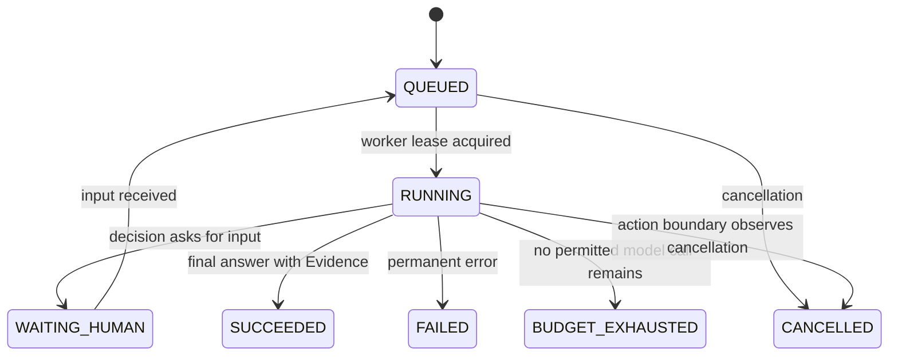

# Athena Agent Runtime Delivery Task

## 1. Product Goal

Deliver a runnable, inspectable Agent Runtime rather than another CloudOps-only workflow.

The first vertical slice is a read-only code repository diagnosis Agent:

```text
Bug / issue description
-> create durable AgentTask
-> bounded ReAct ticks
-> search/read/test tools
-> Evidence and Artifact collection
-> root-cause report with repair recommendation
```

The CloudOps code remains available as a legacy adapter. It is not deleted or used as the Runtime's core domain.

## 2. Scope

### Included

- A single `AgentRuntime.advance(task_id, lease_id, resume_input=None)` execution seam.
- Durable task state, Tick events, checkpoints, Evidence, Artifacts, and Token Ledger.
- Bounded ReAct: one structured decision and at most one logical action per Tick.
- Read-only code tools: `search_code`, `read_file_range`, `get_symbol_outline`, `run_test`, and `read_artifact_range`.
- Context compilation, running summary, selected tool-schema injection, and task budget modes.
- Model routing with a deterministic demo adapter so the full product runs without an API key.
- A Codex-inspired Runtime Console backed by live task APIs, not fixture dashboard data.
- Task creation, task list/detail, run/resume, cancel, event stream/polling, evidence, context, and token inspection.
- Focused integration and browser-facing static tests.

### Explicitly excluded from this delivery

- Autonomous writes to the repository, arbitrary shell execution, Git commit, deploy, or production CloudOps actions.
- Automatic promotion of a Skill to `ACTIVE` without the evaluation lifecycle.
- General-purpose multi-agent fan-out. The UI may show delegation-ready data, but the first slice executes one coordinator.
- Replacing every legacy CloudOps API in the same change.

## 3. Ubiquitous Language

| Term | Meaning |
|---|---|
| AgentTask | One durable user goal with an explicit token/cost budget. |
| Tick | One bounded ReAct cycle with one structured decision. |
| Decision | `final`, `tool_call`, `ask_human`, or `fail`; never hidden chain-of-thought. |
| Evidence | A source-backed fact derived from a tool result. |
| Artifact | A large immutable tool payload addressed by ID. |
| ContextSnapshot | The temporary compiled payload supplied to a model for one Tick. |
| Checkpoint | Recoverable WorkingState after a committed Tick. |
| Skill | A versioned, evaluated procedural memory; this slice reads but does not auto-publish Skills. |

## 4. Runtime Contract



`AgentRuntime.advance()` is the only execution seam. It must:

1. Load task and last Checkpoint under a lease.
2. Compile a ContextSnapshot from TaskFrame, WorkingState, Evidence, summary, recent events, selected tools, and optional retrieved memory.
3. Reserve Token budget and route a model for the decision purpose.
4. Parse and validate a structured Decision.
5. Validate/execute a tool through `ToolRuntime`, or finalize / wait / fail.
6. Persist Tick, Evidence references, TokenLedger entry, and Checkpoint atomically enough for at-least-once recovery.

## 5. Runtime API Contract

| Method | Path | Result |
|---|---|---|
| `POST` | `/api/runtime/tasks` | Create an AgentTask from goal, repository path, and optional profile. |
| `GET` | `/api/runtime/tasks` | List tasks and terminal/active status. |
| `GET` | `/api/runtime/tasks/{task_id}` | Detail: Task, ticks, current state, report, budget. |
| `POST` | `/api/runtime/tasks/{task_id}/run` | Advance until a boundary or terminal state in demo mode. |
| `POST` | `/api/runtime/tasks/{task_id}/input` | Supply human input and resume a waiting task. |
| `POST` | `/api/runtime/tasks/{task_id}/cancel` | Request cancellation at the next action boundary. |
| `GET` | `/api/runtime/tasks/{task_id}/events` | Read ordered public events after a cursor. |
| `GET` | `/api/runtime/tasks/{task_id}/evidence` | Read Evidence cards and Artifact references. |
| `GET` | `/api/runtime/tasks/{task_id}/context` | Read the current compiled context projection, never hidden reasoning. |
| `GET` | `/api/runtime/tasks/{task_id}/usage` | Read TokenLedger and routing reasons. |

The exact implementation may adapt existing task repositories, but must preserve these client-visible semantics.

## 6. Context, Memory, and Token Rules

```text
ContextSnapshot =
  StaticPolicy + TaskFrame + WorkingState + PinnedEvidence
  + RunningSummary + TokenBoundedTail + SelectedToolSchemas
```

- Raw messages and tool output are persisted as events/artifacts, not copied into every model call.
- `Bin = model_window - output_reserve - safety_margin` defines available input.
- At 75% of `Bin`, prepare a structured summary candidate; at 90%, compaction is mandatory before a new model call.
- Preserve task goal, constraints, unresolved tool-call/result pairs, pending plan items, and pinned Evidence during compaction.
- Task budget modes: `NORMAL <70%`, `ECONOMY 70-85%`, `CONVERGE 85-95%`, `FINALIZE 95-100%`, then `BUDGET_EXHAUSTED`.
- Working Memory is the durable Checkpoint; long-term retrieval is not injected by default.

## 7. Tool Rules

- Tool catalog cards are concise; inject at most 3 complete JSON Schemas per Tick.
- A tool call in active context keeps its schema and matching result visible until it reaches a terminal state.
- System-injected values (`task_id`, repository root, permission scope, `call_id`) are never model-controlled arguments.
- All initial tools are `READ` risk. Tool results are transformed into Artifact + ToolResultCard + Evidence.
- `EffectJournal` still records `RESERVED -> RUNNING -> SUCCEEDED/FAILED/UNKNOWN`, even though first-slice tools are read-only.

## 8. Frontend Requirements

Build a real Runtime Console, visually inspired by Codex's workbench density and event-centric execution view, without copying branding or assets.

```text
Left:   task list, status, skill/evaluation navigation
Center: task goal, Tick timeline, tool calls, tool results, final report
Right:  Run, Context, Evidence, Token inspectors
Bottom: create task, run/resume, human-input composer
```

- No static fake metrics. Every displayed task/tick/evidence/token value comes from the Runtime API.
- Never render raw hidden Thought. Render Decision category, tool name, Evidence, and public event payloads.
- Support narrow screens without overlap; preserve keyboard-accessible controls and clear empty/loading/error states.

## 9. Test Seams and Acceptance Criteria

The agreed seams are `AgentRuntime.advance`, Runtime HTTP API, `ToolRuntime.invoke`, `ContextCompiler.compile`, and the Console's API/event projection.

### Backend acceptance

1. A user can create a code-diagnosis task against a controlled fixture repository and run it to a sourced final report without an external API key.
2. The task records ordered Tick events, one or more Evidence cards, TokenLedger entries, and a terminal Checkpoint.
3. A long input/tool artifact triggers context compaction without losing goal, pending item, or Evidence reference.
4. Invalid/unknown tool calls are rejected by runtime validation; read-only scope rejects paths outside the chosen repository.
5. Cancellation is observed at an action boundary. A waiting task accepts operator input and resumes.
6. No endpoint returns raw chain-of-thought.

### Frontend acceptance

1. A task can be created, run, selected, and inspected entirely from the browser UI.
2. The timeline shows actual API events in sequence and recovers cleanly after a refresh.
3. Context, Evidence, and Token inspectors show real API data and useful empty states.
4. Console assets are covered by static/module tests; the primary browser workflow is covered by Playwright when available.

### Quality gate

```text
pytest focused Runtime suite passes
existing web console regression suite passes
no context window overflow in demo suite
no unscoped write tool exists
frontend renders at desktop and mobile widths
```

## 10. Delivery Workstreams

| Workstream | Ownership | Write scope |
|---|---|---|
| Runtime core | Main implementation | `athena/runtime/`, runtime API/service integration, migrations if required |
| Runtime Console | Frontend sub-agent | new Runtime Console modules/styles with no legacy page rewrites until integration |
| Runtime tests | Verification sub-agent | new focused runtime/API/frontend tests only |
| Integration | Main implementation | route registration, server wiring, final test fixes |

## 11. Delivery Sequence

1. Establish Runtime domain objects and a deterministic demo model/tool adapter.
2. Drive `AgentRuntime.advance` through focused failing tests.
3. Expose Runtime API and event/evidence/context/usage projections.
4. Implement Console against the public API contract.
5. Integrate, run tests, inspect the UI, and provide one command to start the product.
