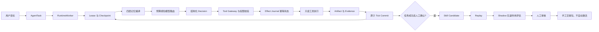

# Agent Runtime V1 实现说明

Athena 现在以通用 Agent Runtime 为核心，代码仓库诊断只是第一个可验证的只读落地切片。Kubernetes/CloudOps 保留为旧适配器，不决定 Runtime 的核心抽象。

## 一、完整执行链路



一个 `advance()` 最多完成一个结构化 Decision 和一个逻辑动作。HTTP 的“运行到边界”只是 Worker 连续调用多个 Tick，每个 Tick 仍然有独立的租约、Token 结算和 Checkpoint。

## 二、模块职责

| 模块 | 主要实现 | 解决的问题 |
| --- | --- | --- |
| 执行平面 | `athena/runtime/runtime.py`、`runtime_worker.py` | bounded ReAct、取消、人工输入、预算边界 |
| 持久化平面 | `athena/runtime/durable/store.py` | SQLite/SQLAlchemy、租约 fencing、Checkpoint 恢复、原子提交 |
| 决策平面 | `athena/runtime/llm_engine.py`、`infra/model_router.py` | 复杂度路由、严格 JSON、一次修复、失败转人工 |
| 工具平面 | `athena/runtime/tools.py`、`runtime/tool_gateway.py` | 工具白名单、仓库路径边界、服务端字段隔离、只读能力 |
| 记忆平面 | `athena/runtime/memory/` | Working、Summary、Evidence、Evaluated Skill 四层上下文 |
| 学习平面 | `athena/runtime/learning/` | Candidate、Replay、Shadow、人工审核与手工交接 |
| API 平面 | `api/routes/runtime_tasks.py`、`runtime_learning.py` | 任务、事件、证据、上下文、用量和学习生命周期 |
| 前端平面 | `web/static/runtime-console.js` | 任务列表、Tick 时间线、Context/Evidence/Usage 检查器 |

## 三、Token 与模型策略

每次模型调用先计算输入容量：

```text
input_capacity = model_window - output_reserve - safety_margin
```

当前默认值是 `16,384 - 512 - 1,024 = 14,848` 个输入 Token。Artifact 原文只落库，不默认进入 Prompt；模型只看到 Evidence 摘要和 Artifact ID。

模型路由不额外调用一个模型做分类，而是根据目标长度、代码特征、复杂关键词和对话轮次计算复杂度分数：

- `simple` 任务强制偏向 economy/light 模型。
- `complex` 任务偏向 quality/heavy 模型。
- `standard` 任务按复杂度阈值选择 light/heavy。
- 任务消耗达到 70% 后进入 `ECONOMY`，85% 后进入 `CONVERGE`，95% 后进入 `FINALIZE`。
- 75% 输入容量只标记摘要候选；90% 强制压缩；强制压缩时移除可选 Skill，只保留目标、约束、计划、未决工具对和 Evidence 引用。

模型输出必须是严格 Decision JSON：`tool_call`、`final`、`ask_human` 或 `fail`。格式错误最多修复一次，仍失败就等待人工；任何非法 JSON 都不能进入工具执行路径。

## 四、工具调用与恢复

模型只能提供业务参数，以下字段由服务端注入且不可覆盖：`task_id`、租户、仓库根目录、权限范围、`call_id`、租约等。每个 Tick 最多向模型展示三个完整工具 Schema。

Runtime 专用 Effect Journal 使用确定性 `effect_id = hash(task_id, tick_sequence, tool_name, arguments)`：

```text
RESERVED -> 工具执行 -> SUCCEEDED / FAILED
```

工具结果先写入 Journal，再和 Tick、Artifact、Evidence、Usage、Checkpoint 一起提交。如果进程在工具返回后、Aggregate Commit 前崩溃，恢复 Worker 会复用已完成的 Artifact/Evidence，不会再次调用同一个只读工具效果。

## 五、记忆四层

1. Working Memory：Checkpoint 中的计划、待办、人工输入、Pinned Evidence 和未决工具对。
2. Running Summary：结构化的已完成事实、失败尝试、开放问题和下一步动作，不保存完整聊天 transcript。
3. Evidence Memory：来源、摘要、Artifact 引用；Artifact 原文按需读取。
4. Skill Memory：只有 `APPROVED` 且经过评估的 Skill 才能召回，Candidate 不会进入 Prompt。

这四层由 `MemoryLayer.compile()` 生成稳定的 `runtime.memory.v1` 投影，再由 `FourLayerRuntimeContextCompiler` 补充服务端选择的工具 Schema，供旧 Demo 引擎和 LLM 引擎共同使用。

## 六、自进化闸门

```text
成功任务 + 足够 Evidence + 已验证人工反馈
    -> Candidate
    -> Replay（固定样例）
    -> Shadow（effect_count 必须为 0）
    -> 人工 Review
    -> 手工交接包
```

任一前置条件不满足都会阻断流程。审核通过的响应明确包含 `activation_allowed=false`，不会把模型输出直接写成可执行 Skill，也不会自动加入 Skill Memory。

## 七、运行模式与验收

- 无数据库、无 API Key：内存 Store + 四层记忆 + 确定性 Demo DecisionEngine，可完整跑通代码诊断。
- 配置 LLM：使用严格 JSON `LLMDecisionEngine`，模型路由和实际 Token 用量进入 Usage。
- 配置 `ATHENA_DATABASE_URL=sqlite:///...` 并开启 `ATHENA_DATABASE_AUTO_MIGRATE=true`：使用 Durable Store，支持租约恢复和 SQLite 重启读取。
- 前端入口：`http://127.0.0.1:8000/?frontend=runtime`。

主要验收命令：

```powershell
pytest -q (Get-ChildItem tests -Filter 'test_runtime*.py' | ForEach-Object FullName)
pytest -q tests/test_runtime_effect_journal.py tests/test_runtime_wiring.py tests/test_runtime_learning_api.py
```

当前 V1 仍以单 Coordinator 为默认执行拓扑；多 Agent fan-out 要等单 Coordinator 的恢复、预算和工具账本稳定后再增加子任务预算、取消传播和聚合策略。
