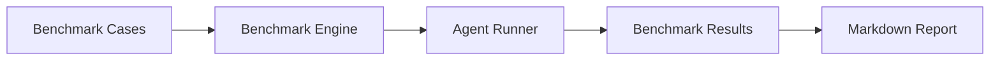

# Benchmark Evaluation System

## Design Goal

The benchmark system evaluates CloudOps agent behavior using reproducible cases and quantitative metrics: task success rate, average steps, hallucination rate, recovery rate, and latency.

## Key Decisions

- `BenchmarkEngine` accepts an injected async runner, so tests can use a deterministic fake agent.
- Hallucination is judged by empty/unknown answers and expected keyword checks in this first implementation.
- Reports are generated from raw results, keeping data reproducible.

## Interview Talking Points

- The benchmark emphasizes measurement methodology over inflated numbers.
- It supports comparison between single-agent mode, multi-agent mode, and future CloudOps workflows.
- Metrics are deterministic and can be run in CI.