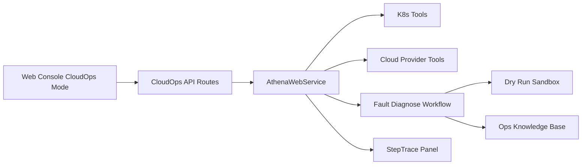
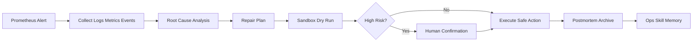

# CloudOps Agent Vertical Scenario

## Design Goal

Athena CloudOps turns the general-purpose Agent foundation into a cloud-native operations assistant. It covers Kubernetes operations, cloud resource inspection, fault diagnosis, cost optimization, and operations knowledge reuse.

## Fault Diagnosis Flow

## Implemented Scenarios

| Mode | Endpoint | Capability |
| --- | --- | --- |
| K8s 运维 | `POST /api/cloud-ops/run` with `mode=k8s` | Pod/node/event snapshot, CrashLoopBackOff and ImagePullBackOff SOP diagnosis |
| 资源巡检 | `mode=resource` | Mock Aliyun/Tencent/AWS instance inspection, security group check, monitoring metrics |
| 故障排查 | `mode=fault` | Alert to context collection, root cause, repair plan, sandbox verification, knowledge archive |
| 成本优化 | `mode=cost` | Idle resource detection and monthly saving estimate |

## Safety Rules

- Read-only operations execute automatically.
- Write operations are represented as risk-aware operation results.
- High-risk operations require `confirmed=true` before execution.
- Each CloudOps response includes trace-compatible steps for the Web Console right panel.

## Interview Talking Points

- The vertical scenario reuses Athena's existing API layer, workflow engine, trace model, and safety concepts.
- Mock clients keep demos reproducible without real cloud credentials, while the adapter boundary is ready for official SDK calls.
- The fault workflow demonstrates a complete loop: alert, diagnose, recommend, verify, archive, and reuse.