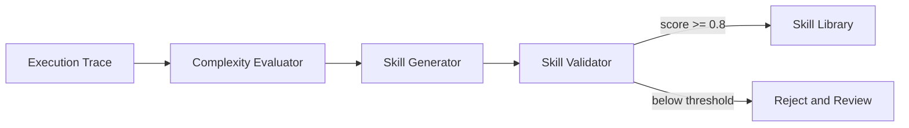

# GEPA Self-Evolution Loop

## Design Goal

GEPA closes the loop from execution traces to reusable skills. Athena records task events, evaluates complexity, extracts successful patterns, validates generated skills in the sandbox, and only then allows the skill to be loaded into the library.

## Key Decisions

- Complexity score combines step count, tool diversity, and task difficulty.
- Skill generation returns the existing `Skill` model, so retrieval and hot loading reuse the memory layer.
- Skill validation is sandbox-gated. A generated skill must pass structural checks and sandbox simulation before acceptance.

## Interview Talking Points

- Ordinary agents only execute tasks; Athena turns successful traces into reusable skills.
- The validation gate prevents failed or noisy trajectories from polluting the skill library.
- The design is open for LLM-based skill generation later because the output contract is already structured.