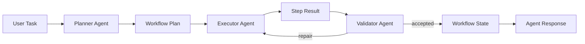

# Multi-Agent Plan-And-Execute Workflow

## Design Goal

The workflow engine implements a lightweight three-role collaboration model: planner, executor, and validator. It reuses the existing tool registry and does not introduce any third-party agent framework.

## Key Decisions

- `WorkflowMessage`, `WorkflowPlan`, and `WorkflowStepResult` form the role communication contract.
- `WorkflowState` stores current index and results, which is the minimum state needed for breakpoint resume.
- Single-agent and multi-agent modes share `ToolRegistry`, `ToolExecutor`, and `AgentResponse`.

## Interview Talking Points

- Plan-and-Execute is useful for complex CloudOps tasks where planning, execution, and validation have different failure modes.
- The implementation is intentionally lightweight to avoid role explosion.
- The workflow engine is self-written and does not depend on LangChain, AutoGen, or LlamaIndex.