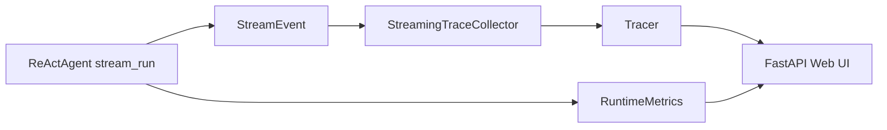

# Streaming And Observability

## Design Goal

Athena exposes a streaming execution interface and an observability platform that can collect stream events, metrics, traces, and debugger states.

## Key Decisions

- `run()` remains backward compatible; `stream_run()` is added as an async generator.
- `RuntimeMetrics` tracks task success, task duration, and first-token latency.
- The web layer is a thin FastAPI app over trace and metric stores.

## Interview Talking Points

- Streaming is implemented at the execution layer, not just the UI layer.
- Observability data is structured and reusable for replay, debugging, and evaluation.
- The system can evolve toward WebSocket streaming without changing the core event contract.