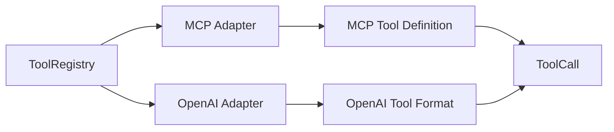

# Tool Protocol Compatibility

## Design Goal

Athena keeps its self-developed tool registry as the core, then adds format adapters for MCP-style tools and OpenAI-style function calls. Protocol support is an adapter layer, not a dependency on external SDKs.

## Key Decisions

- Adapters export tool schemas from `ToolRegistry` metadata.
- Incoming protocol payloads are normalized into the same `ToolCall` model.
- Core execution remains inside `ToolRegistry` and `ToolExecutor`.

## Interview Talking Points

- This proves understanding of industry tool-call formats without outsourcing the agent core.
- Adding a new protocol later only requires another adapter.
- The core tool lifecycle remains fully controlled and testable.