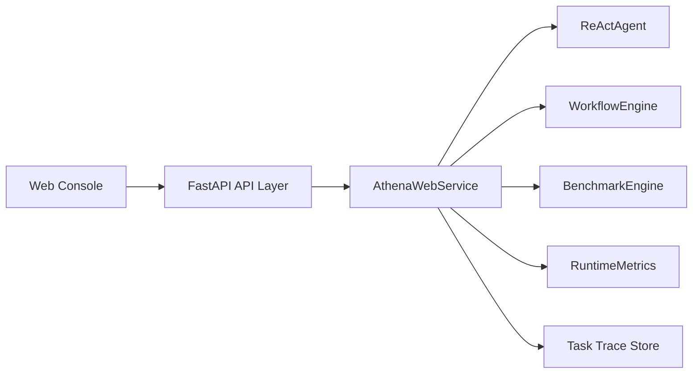

# Athena Web Console

## Design Goal

The Web Console upgrades Athena from a command-line MVP into a browser-accessible service. The API layer wraps existing Agent capabilities without moving business logic into route handlers.



## Directory Layout

- `athena/api/server.py`: FastAPI application factory, CORS, error handlers, route mounting, static file mounting.
- `athena/api/services.py`: service facade that owns sessions, tasks, metrics, traces and delegates to core modules.
- `athena/api/routes/`: thin route files for sessions, chat, workflow, traces, metrics and benchmark.
- `athena/web/static/`: native HTML, JavaScript and CSS console with no frontend build step.

## API List

| Method | Path | Purpose |
| --- | --- | --- |
| POST | `/api/sessions` | Create an isolated Agent session |
| GET | `/api/sessions` | List active sessions |
| GET | `/api/sessions/{session_id}` | Read session detail and messages |
| POST | `/api/chat` | Run synchronous Agent chat |
| POST | `/api/chat/stream` | Run SSE streaming Agent chat |
| POST | `/api/workflow/run` | Run Plan-and-Execute workflow |
| GET | `/api/workflow/{task_id}/status` | Read workflow task status |
| GET | `/api/traces/{task_id}` | Read task trace events |
| GET | `/api/metrics` | Read global runtime metrics |
| POST | `/api/benchmark/run` | Run benchmark cases |
| GET | `/api/benchmark/{run_id}/report` | Read benchmark markdown report |

## Usage

```powershell
athena web --host 127.0.0.1 --port 8000
```

Then open:

```text
http://127.0.0.1:8000
```

## Key Decisions

- Routes only validate requests and wrap responses. Agent orchestration lives in `AthenaWebService`.
- Sessions keep isolated `ReActAgent` instances and working memory.
- Streaming uses real `ReActAgent.stream_run()` events and sends them as SSE chunks.
- Frontend uses native browser APIs and Tailwind CDN, so there is no Node.js build pipeline.

## Interview Talking Points

- This layer demonstrates service-oriented Agent deployment without introducing a third-party Agent framework.
- The service facade keeps API concerns separate from Agent reasoning, which preserves testability.
- The frontend is intentionally lightweight: it proves product accessibility while keeping the engineering focus on Agent architecture.