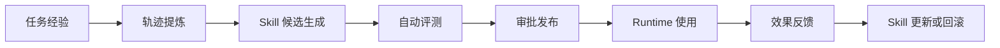
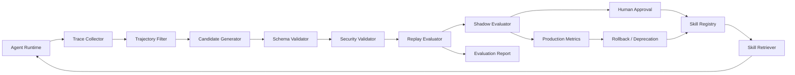
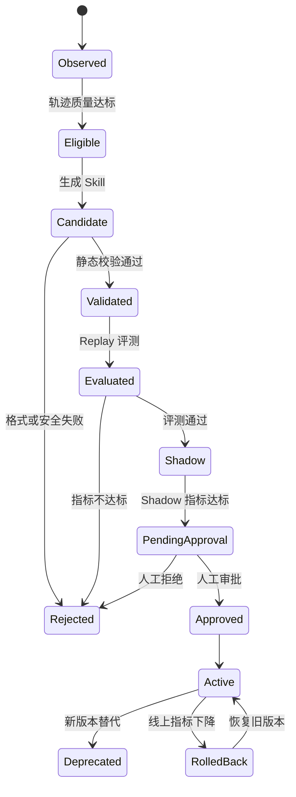
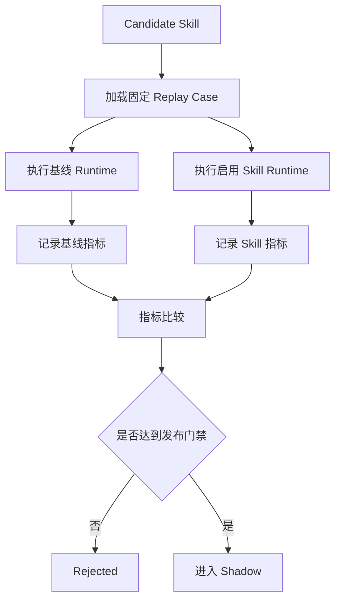
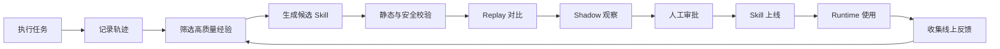

# Athena Skill 自进化实施计划

> 状态：已确认，待实施
> 范围：仅规划，不包含代码实现
> 首个领域：只读代码仓库诊断 Agent

## 1. 目标与边界

将 Athena 从能够执行任务的 Agent Runtime，升级为具备可控自进化能力的 Runtime：从高质量任务轨迹中提取可复用经验，生成候选 Skill，自动评测，审批后上线，并依据线上效果持续迭代或回滚。

这里的自进化是**基于轨迹蒸馏的程序化记忆自进化**，不是训练或微调大模型权重。



第一版限定为只读代码仓库诊断，支持：Bug 根因定位、测试失败分析、配置错误定位、调用链分析、修复建议生成、长工具输出的 Evidence 提取。

第一版不支持自动修改代码、部署、删除文件、安装系统软件、任意宿主机操作或无限自动学习循环。

### P0 基础数据与轨迹准入切片（2026-08-12）

已落地的基础边界：

- `TrajectorySummary` 只持久化脱敏任务/结果摘要、工具名与结果状态、Evidence 引用摘要、Usage 和预算汇总；不包含 Artifact 原文、工具参数、仓库根目录、原始 Prompt/Response 或隐藏推理。
- 轨迹状态固定为 `Observed -> Eligible | Rejected`。准入同时要求任务成功、Evidence 完整、无安全违规、无工具越权且未超过 Token/Tick 预算；拒绝原因和五项加权质量分均持久化。
- `Eligible -> Candidate` 只能由显式结构化请求触发，不调用模型生成 Skill。Candidate 必含工具白名单、Procedure、失败恢复、成功契约、Evidence 要求、预算提示、来源轨迹、评测状态与风险级别。
- Candidate 初始状态强制为 `candidate`、评测状态强制为 `not_evaluated`、风险限制为只读 `S1`；数据库约束和应用服务均不提供直接进入 `active` 的路径。
- 本切片不新增发布、Shadow、前端、写文件、任意 Shell、部署或删除能力，也不修改任何现有 Active Skill。

### P0 Candidate 校验与固定 Baseline 切片（2026-08-12）

- Candidate 使用显式版本化 Schema，并通过确定性 Validator 校验必填字段、版本、成功契约、来源 Eligible 轨迹和 Candidate-only Manifest 不变量。
- `allowed_tools` 必须来自 Runtime 当前只读工具目录；工具的 `readonly`、风险级别、Capability 和参数 Schema 复用 Runtime 的 `ToolSpecV2` 与参数校验规则。未知工具、写工具、服务器控制参数和不可见双向控制字符均拒绝。
- 校验报告独立持久化；通过时 Candidate 仍保持 `candidate`，失败时只能进入 `rejected`。两种结果都保留审计事件且 `activation_allowed=false`。
- 固定 Replay Case 共 12 个：4 个简单只读任务、4 个多步骤代码诊断、2 个真实工具失败、2 个安全拒绝。每个 Case 固定输入、夹具、工具策略、Evidence、Tick/工具调用上限和确定性 Oracle。
- Baseline 使用离线固定决策驱动真实 `AgentRuntime` 和只读工具执行，不加载 Candidate，不访问模型 Provider，仅记录实际 Task 状态、Tick、工具调用、Evidence、Usage、拒绝原因和耗时。
- 本切片只形成供下一阶段比较的结构化 Baseline 结果；不实现 Candidate vs Baseline 比较、模型生成、Shadow、审批页面、发布或 Active Skill 修改。

## 2. 总体架构



| 模块 | 职责 |
|---|---|
| Trace Collector | 记录任务执行过程和资源消耗 |
| Trajectory Filter | 判断哪些轨迹值得学习 |
| Candidate Generator | 从轨迹生成候选 Skill |
| Schema Validator | 校验 Skill 格式和字段 |
| Security Validator | 校验工具权限和安全风险 |
| Replay Evaluator | 用固定任务验证 Skill |
| Shadow Evaluator | 旁路观测候选 Skill 的效果 |
| Approval Manager | 审批、发布、回滚 |
| Skill Registry | 管理 Skill 生命周期与版本 |
| Skill Retriever | 运行时检索并按需加载 Skill |

关键原则：

- Runtime 不直接修改生产 Skill。
- Skill 生成和 Skill 发布必须分离。
- 所有新 Skill 先进入 Candidate 状态。
- 自动评测失败时不得自动上线。
- 所有 Skill 必须可追踪、可比较、可回滚。

## 3. 核心领域对象

| 名称 | 定义 |
|---|---|
| Trajectory | 一次完整任务的执行轨迹，含决策、工具调用、Evidence、错误、结果、Token 与安全事件 |
| Skill Candidate | 从轨迹中生成、尚未上线的候选 Skill |
| Approved Skill | 已完成评测与审批、可被 Runtime 检索的 Skill |
| Replay Case | 可重复运行的标准任务，用来评测 Skill |
| Skill Version | 同一 Skill 的一个版本；每次改动产生新版本 |
| Promotion | Candidate 升级为可用 Skill 的过程 |
| Rollback | 发现效果变差后恢复上一 Active 版本 |

## 4. Skill Schema

第一版每个 Skill 至少拥有下列字段：

| 字段 | 作用 |
|---|---|
| `skill_id` | 唯一标识 |
| `version` | 版本号 |
| `name` | 人类可读名称 |
| `description` | 简短触发描述 |
| `trigger` | 适用任务特征 |
| `allowed_tools` | 允许使用的工具 |
| `procedure` | 执行步骤 |
| `failure_recovery` | 工具失败处理流程 |
| `success_contract` | 成功定义 |
| `evidence_requirements` | 必须保留的证据 |
| `token_budget_hint` | 建议 Token 预算 |
| `source_trajectory_ids` | 来源轨迹 |
| `evaluation_status` | 评测状态 |
| `created_at` / `updated_at` | 创建、更新时间 |
| `parent_version` | 基于哪个版本修改 |
| `risk_level` | 风险等级 |

Skill 不只是 Markdown 文本，同时需要具备可检索元数据、可评测成功契约和工具权限限制。

## 5. Skill 生命周期



禁止以下路径：

```text
成功轨迹 -> 直接写入 Active Skill
```

## 6. 分阶段实施计划

### 阶段 0：准备与范围冻结（预计 1～2 天）

目标：固定 P0 领域、对象、数据集和验收规则，避免开发中持续改题。

工作项：

1. 将首个垂直领域固定为“只读代码仓库诊断”。
2. 固定核心术语：Trajectory、Candidate、Replay Case、Approved Skill、Promotion、Rollback。
3. 明确读写边界：仅允许当前 Runtime 已注册的只读工具。
4. 明确公开数据边界：`.env`、密钥、原始 Prompt/Response、Artifact 原文不提交 GitHub；仅提交脱敏摘要、测试夹具、结果报告。
5. 定义 Skill Schema 与生命周期状态机。
6. 建立 12 个固定 Replay Case：4 个简单任务、4 个多步骤任务、2 个工具失败任务、2 个安全拒绝任务。

每个 Replay Case 必须定义：用户输入、固定夹具、允许与禁止工具、预期根因、必需 Evidence、最大 Tick、最大工具调用数、允许结论和预期失败行为。

验收：团队或个人能够用一页表格说明每个 Case 的输入、Oracle、限制与成功条件。

### 阶段 1：轨迹采集与质量筛选（预计 2～3 天）

目标：让每个任务都形成结构化可学习轨迹，并只选择值得学习的经验。

需要记录：

- Task、每个 Tick、模型决策、工具调用、工具结果和最终结果；
- Evidence、错误、人工介入和安全事件；
- 输入 Token、输出 Token、总 Token、延迟、Tick 数、工具调用数；
- 任务是否完成、是否满足 Success Contract。

筛选准入条件：任务成功、Evidence 完整、无安全违规、无越权、无密钥泄露、工具顺序合理、结果不依赖偶然信息。

优先轨迹：重复任务模式、多步骤任务、多个工具协作、成功恢复工具失败、降低 Token 或 Tick 的轨迹。

排除轨迹：一次性问答、依赖临时用户信息、依赖特定路径、未经验证的猜测、仅单样本偶然成功。

初版可解释质量分：

```text
trajectory_score =
  35% 任务成功
+ 25% Evidence 完整度
+ 15% 工具效率
+ 15% 可复用程度
+ 10% 安全与稳定性
```

验收：任一成功任务均能定位到完整轨迹；任一不合格轨迹均能说明被过滤的明确原因。

### 阶段 2：轨迹压缩与 Candidate 生成（预计 2～3 天）

目标：从高质量轨迹中提炼通用技能，且不把完整历史和大工具输出塞进模型上下文。

流程：

```text
原始轨迹
  -> 去重重复工具输出
  -> 移除无关思考文本
  -> 保留关键决策、参数、失败与恢复
  -> 保留 Evidence 摘要和 Artifact 引用
  -> Trajectory Digest
  -> Candidate Skill
```

Trajectory Digest 仅包括任务目标、环境信息、关键步骤、工具序列、失败原因与恢复、最终证据、成功结果和资源消耗。

候选生成规则：

- 抽取通用流程，去除一次性文件名、路径和环境信息；
- 只引用已注册工具；
- 明确前置条件、失败恢复、成功契约和 Evidence；
- 给出 Token 预算建议；
- 关联来源轨迹和父版本；
- 先检查是否存在相似 Skill。

模型分级：规则清洗优先；普通初稿使用轻量/低成本模型；高风险、冲突或复杂合并才使用高质量模型；格式校验与大多数评测使用确定性规则。

验收：能从一个符合准入条件的多步骤轨迹生成结构化 Candidate，且不自动上线。

### 阶段 3：静态校验、安全审查与去重（预计 2 天）

目标：阻止不完整、越权、重复或被外部内容污染的 Candidate 进入评测。

Schema 校验：必填字段、字段类型、命名、版本号、工具存在性、参数 Schema、成功契约可执行性、预算合理性、来源轨迹存在性。

安全校验：

- `allowed_tools` 必须是 Tool Registry 的子集；
- Policy Engine 和 Runtime Gateway 对每次工具调用再次校验；
- Skill 无法绕过 Runtime 的安全策略；
- 外部文件、README、网页和工具结果一律视为数据而非指令；
- 清理不可见字符与双向控制字符；
- 对可疑内容记录安全事件。

去重策略：比较触发条件、工具集合、步骤、成功契约、文本相似度与行为相似度。完全重复不创建；小幅变更创建新版本；能力冲突进入人工审核；完全不同则创建新 Skill。

验收：含未知工具、写操作、无成功条件或越权参数的 Candidate 必须被拒绝，且无法被 Runtime 加载。

### 阶段 4：Replay 自动评测（预计 3～4 天）

目标：以固定任务集验证 Skill 是否真正提高效果，而不是只验证它能生成文本。



每个 Case 最少运行 Baseline（不加载新 Skill）和 Candidate（加载新 Skill）各一次。

评测指标：

| 分类 | 指标 |
|---|---|
| 正确性 | 成功率、根因准确率、Evidence 保留率、答案结构完整率 |
| 效率 | 平均 Tick、工具调用数、输入/输出/总 Token、延迟、重试次数 |
| 安全 | 非法工具、越权访问、高风险动作、注入成功、密钥泄露 |
| 稳定性 | 重复一致性、超时率、回滚率、人工介入率 |

P0 发布门禁：

- Candidate 解析成功率 100%；
- 安全违规与非法工具调用均为 0；
- 任务成功率和 Evidence 保留率不得低于基线；
- 平均 Tick 增幅不超过 10%；
- 总 Token 增幅不超过 5%；
- 工具调用数增幅不超过 10%；
- 关键 Case 必须全部通过；
- 工具失败 Case 必须符合预期处理；
- 回滚测试必须通过。

验收：自动生成 Baseline 与 Candidate 对比报告，并给出每个 Case 的通过、失败和门禁原因。

### 阶段 5：Shadow 模式（预计 2 天）

目标：评测通过后先旁路观察，避免未经真实分布验证的 Skill 改变生产结果。

行为：主 Runtime 正常执行；Shadow Runtime 旁路加载候选 Skill，仅记录其选择、预测与资源消耗；最终答案仍采用主 Runtime。

Shadow 记录：可能的工具选择、Tick/Token 变化、答案是否改变、安全策略触发、失败概率和误触发次数。

建议门禁：覆盖 20～50 个真实或回放任务；覆盖触发范围；成功率不明显低于基线；无安全违规；无频繁误触发；不明显增加 Token；不污染已有记忆。

验收：Shadow 任务不影响用户实际结果，并能产出候选与基线的对比指标。

### 阶段 6：审批、发布、回滚（预计 2 天）

目标：把上线权从生成器中隔离出来，使每个 Active Skill 均可解释、可恢复。

默认路径：

```text
Candidate -> 自动校验 -> Replay -> Shadow -> 人工审批 -> Active
```

审批页展示：名称、版本、来源轨迹、触发条件、工具白名单、前后差异、Replay/Shadow 结果、Token 与成功率对比、安全结果、风险等级、审批/拒绝原因、回滚入口。

自动回滚候选条件：成功率或 Evidence 下降、工具失败上升、非法调用尝试增加、Token 显著增加、误触发增多或用户明确否定结果。

回滚要求：保留问题版本；恢复上一 Active 版本；记录原因；禁止问题版本自动重发；将失败轨迹补充进 Replay 数据集。

验收：可由 UI 或受控接口审批、拒绝和回滚；重启后状态与版本不丢失。

### 阶段 7：接入 Runtime 检索与按需加载（预计 2～3 天）

目标：让 Approved Skill 真正改善 Runtime，同时避免 Skill 库本身造成上下文膨胀。

检索流程：

```text
用户任务
  -> 任务分类
  -> 触发条件过滤
  -> 工具权限过滤
  -> 风险等级过滤
  -> 相关性排序
  -> Top-K 注入
```

初版限制：最多注入 3 个 Skill；先只注入名称、描述、触发条件和风险等级；高度相关时才加载 Procedure；Reference 文件仅在需要时加载；Candidate、Rejected、Deprecated 均不能被使用。

排序建议：

```text
skill_score =
  相关性
+ 历史成功率
+ 最近使用效果
+ 任务类型匹配度
+ 工具集合匹配度
- Token 成本
- 风险惩罚
```

三层注入：Skill Index -> Skill Procedure -> 按需 Reference。只有确实需要时才逐级展开。

验收：运行事件可追踪使用的 Skill ID 和版本；不匹配 Skill 不会注入；上下文预算不会因 Skill 库增长而线性增长。

### 阶段 8：线上反馈与二次进化（预计 2～3 天）

目标：使已上线 Skill 能被数据驱动地优化，而不是永久固化。

每次 Skill 使用后记录：匹配是否准确、任务结果、工具/Token 节省、错误、降级、用户接受度、人工修改和回滚信号。

进入更新候选的触发条件：连续失败、重复工具错误、出现更优步骤、用户重复纠正、Token 偏高、新工具未使用、触发条件过宽导致误调用。

更新仍必须走完整路径：线上反馈 -> Candidate 新版本 -> Replay -> Shadow -> 审批 -> 发布。不得在线覆盖 Active Skill。

验收：同一 Skill 能以新版本上线；旧版可追踪；效果下降可回滚。

### 阶段 9：前端、报告与开源整理（预计 1～2 周，可与后期并行）

目标：使能力可演示、可复现、可写入简历。

前端增加 Codex 风格的 Skill Evolution 页面：生命周期看板、Skill 详情、版本 diff、来源轨迹、Replay/Shadow 图表、Token 变化、安全结果、审批和回滚操作。

公开材料包括：脱敏 Replay 数据集、实验脚本、固定版本结果 JSON、Benchmark 报告、架构图、运行说明和安全边界说明。

不得公开：`.env`、真实密钥、原始 Prompt/Response、原始 Artifact、用户私有仓库内容。

验收：陌生开发者按文档可运行示例、重放评测、看到报告并理解一次 Skill 从生成到上线的过程。

## 7. Token 控制方案

### 7.1 生成与评测阶段

- 先用规则筛选，只有高质量轨迹才调用模型；
- 原始工具输出转为摘要和引用，重复内容去重；
- 普通候选用轻量模型；复杂冲突与高风险案例才使用高质量模型；
- 静态校验与大多数评测使用确定性代码；
- 缓存静态检查和重复 Case 结果；
- 失败后只重试必要阶段。

### 7.2 运行阶段

- 默认只注入 Top-3 Skill；
- 先索引后展开，Reference 按需读取；
- 简单任务不加载完整 Procedure；
- 每个 Skill 设置 Token 上限；
- 使用 Running Summary 替代完整历史；
- 工具输出先提取 Evidence；
- 不把历史版本注入上下文。

### 7.3 必须量化的收益

```text
Skill 净收益 = 上线后累计节省 Token - Skill 生成与评测 Token
```

报告必须分别记录：生成一个 Skill 的 Token 成本、评测成本、上线后单任务节省、累计节省和摊销周期。不得只用“节省 Token”这一主观描述。

## 8. 测试计划

### 单元测试

- Skill Schema、版本号、工具白名单；
- 触发条件匹配、去重、质量评分；
- 生命周期状态机、Token 预算、回滚；
- 权限拒绝与注入防护。

### 集成测试

- Runtime 产生轨迹；
- 轨迹进入 Candidate；
- Candidate 完成校验、Replay、Shadow、审批和入库；
- Runtime 检索 Active Skill；
- 数据库重启后状态恢复。

### 安全测试

- 未知工具、写操作、越权参数；
- 恶意文件或工具输出中的注入指令；
- 敏感目录和密钥读取；
- Candidate 伪造评测结果；
- 旧版本激活；
- 并发发布冲突。

### 回归测试

确保不破坏既有 ReAct、四层记忆、工具失败处理、Token 统计、模型路由、只读安全策略和 Runtime Console。

## 9. 最终验收场景

1. 成功多步骤任务自动形成 Candidate，并可看到来源 Task ID、流程、Evidence、预算，且尚未上线。
2. 含未知工具、写操作、缺失成功条件或越权参数的 Candidate 被拒绝，不能被 Runtime 加载。
3. 对 12 个 Replay Case 自动执行 Baseline 与 Candidate，并输出门禁结果。
4. Replay 和 Shadow 通过后，经人工审批成为 Active，Runtime 事件可追踪 Skill ID 与版本。
5. 人为构造劣化版本后，系统能识别指标下降并恢复旧版本。
6. 使用同一批任务对比 Baseline 与 Runtime + Approved Skill，真实统计成功率、Evidence、Tick、工具调用、输入/总 Token、延迟和安全违规。

## 10. 推荐实施顺序与周期

```text
1. 固定领域和 Replay Case
2. 统一 Trace 与 Skill Schema
3. 实现轨迹筛选
4. 实现 Candidate 生成
5. 实现静态校验和安全门禁
6. 实现 Replay 评测
7. 实现 Registry 状态机
8. 实现审批与回滚
9. 接入 Runtime Retriever
10. 实现线上反馈和版本迭代
11. 实现 Evolution 前端页面
12. 跑完整 A/B 实验并整理报告
```

里程碑：

| 里程碑 | 预计时间 | 交付物 |
|---|---:|---|
| P0 可运行闭环 | 2～3 周 | Candidate、校验、Replay、审批、Registry、Retriever、回滚 |
| P1 开源/简历版 | 再 1～2 周 | Shadow、前端、Token 成本分析、自动报告、CI 回归 |
| P2 增强版 | 再 2～4 周 | Skill 合并、冲突检测、自动淘汰、多模型/多 Agent 评审 |

## 11. 完成定义

只有满足以下条件，才称为“Skill 自进化 MVP 完成”：

- Agent 能记录完整任务轨迹；
- 能自动筛选高质量轨迹；
- 能生成结构化 Candidate Skill；
- Candidate 经过 Schema 和安全检查；
- 有固定 Replay 数据集与 Baseline 对比；
- 存在明确发布门禁；
- 审批后才由 Runtime 使用；
- Skill 具备版本和回滚；
- 运行效果拥有真实 Token、成功率和安全指标；
- 重启后状态不丢失；
- 前端可展示生成、评测、审批、发布；
- 有可复现的脱敏 A/B 报告。

最终闭环：


